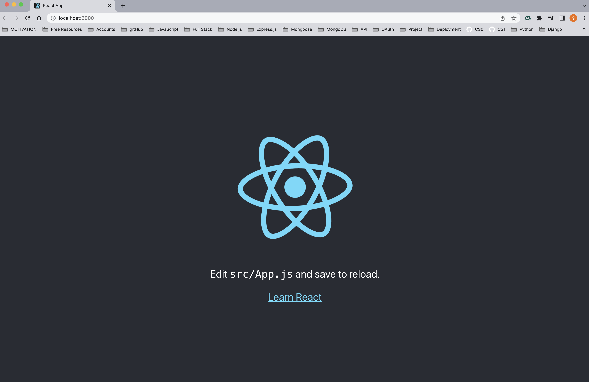

# ReactJS Environment Setup :atom_symbol: 

Creating an app in your computer in React does not have to be difficult. :dizzy: 

1. Open the terminal.
1. Go into the file you want to save your new React app file, `cd newcode` (which is my file where I want to store this app) .
1. If you haven't already, install **NodeJs**.
1. In the command line, run: `npx create-react-app my-app`
1. In the terminal go into your file, `cd my-app`. Now you can see that the tree for a react app is created. This you can check with running `ls` in the terminal.
1. Run `npm start` in your terminal.

1. Open **my-app** in VSCode. If you have already installed the shell path to open VScode from the terminal just run `code .`

Now you can see your app running in the browser in [http://localhost:3000/ ](url) (local port), and you can proceed to update your new react app as you like.

You can also intall the following plug-ins in VScode to make your life easier, this is completely optional:

- Es7 react (It is going to help you autocomplete - react code snippets).
- NPM extension.
- Beautiful UI (This changes the color of your code in VSCode, different themes).
- VsCode Icons Team (Only if you want your icons to be updated).
- Keybindings (IntelliJ IDEA Keybindings or Atom Keymap).
