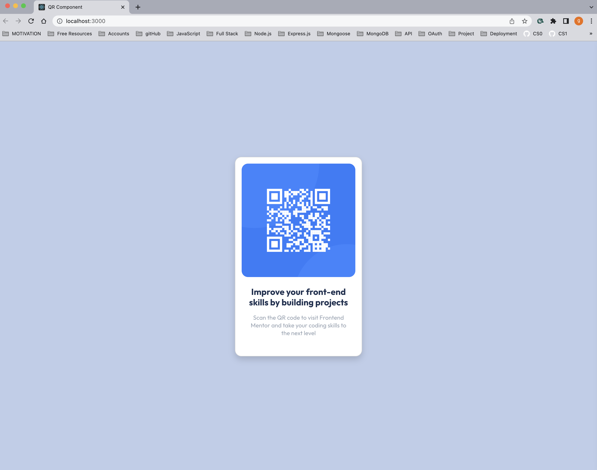

# QR code component

This is a solution to the [QR code component challenge on Frontend Mentor](https://www.frontendmentor.io/challenges/qr-code-component-iux_sIO_H).

## Table of contents

- [Overview](#overview)
  - [Screenshot](#screenshot)
  - [Links](#links)
- [My process](#my-process)
  - [Built with](#built-with)
  - [What I learned](#what-i-learned)
  - [Continued development](#continued-development)
  - [Useful resources](#useful-resources)
- [Author](#author)

**Note: Delete this note and update the table of contents based on what sections you keep.**

## Overview

### Screenshot

### Links

- Solution URL: [Add solution URL here](https://github.com/gianellin/qr-component)

## My process

### Built with

- HTML.
- JavaScript.
- CSS.
- Mobile-first workflow.
- [React-Bootstrap](https://react-bootstrap.github.io/) - Front-end framework
- NodeJS.

### What I learned

This project helped me to put into practice my React-Bootstrap skills. It allowed me to create from scratch a solution using components, and styling from this framework.

### Continued development

I plan to keep working on Front-End projects and challenges, to hone up my skills in React, Bootstrap and JavaScript.

### Useful resources

- [React-Bootstrap Documentation](https://react-bootstrap.github.io/getting-started/introduction/) - This helped me define my components for this asset. I could divide items, and use suggested styling.
- [Stack overflow](https://stackoverflow.com/questions/68951846/giving-border-radius-to-ant-design-card-in-react) - This is an amazing resource for specific coding issues. In this case, I needed details for styling properties.

## Author

- Website - [Gianella Cevallos](https://gianellin.github.io/portfolio_website/)
- Frontend Mentor - [@gianellin](https://www.frontendmentor.io/profile/gianellin)
- Instagram - [@giacodesnow](https://www.twitter.com/yourusername)

